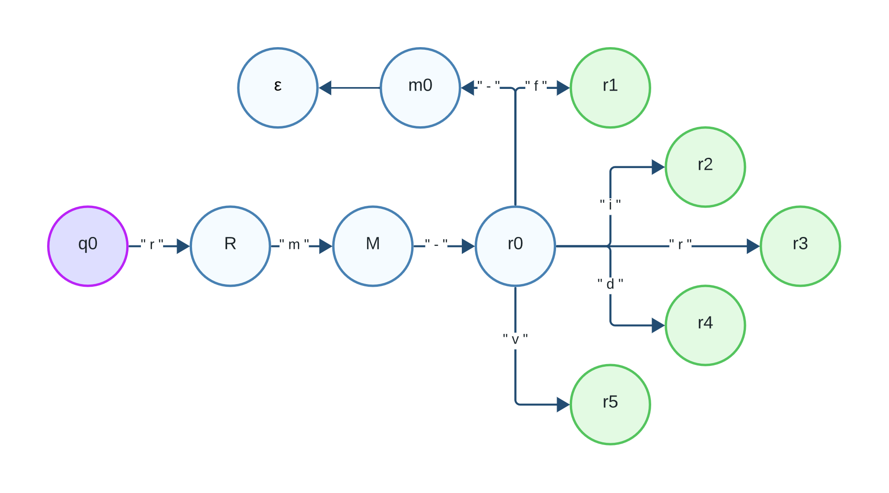
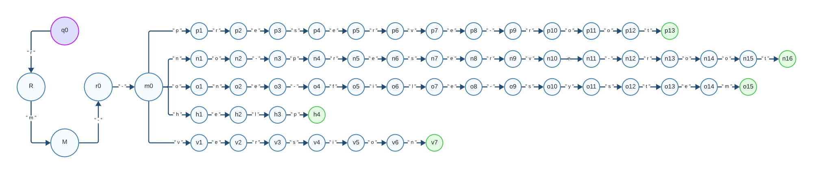

# Description
This first evidence is according to validate a logic programming paradigm using an automaton.

The automaton that i decide to make is about the remove commands of linux consol, for example "rm--one-file-system" or "rm-r". This commands are usually used to remove files in linux using the consol. One thign to consider is that in prolog don't accept whitespaces, so i decide to ignore them.

# Models
- q0 Is the initial state and where everything begings
- R & M are the sequential states after q0 are the first "r" and "m" respectively
- r0 & m0 are the next states where the posibilities divides in wich command are going to validate, a short one or a larger one. 

these commands are represented in the next diagram after the r0 case:

- rm-f - for forced removal
- rm-i - for interactive removal
- rm-r - for recursive removal
- rm-d - for directory removal
- rm-v - for verbose output

After the m0 case i uses an epsilon to indicate that the diagram continues with the other cases.



these commands are represented in the next diagram after the m0 case:

- rm--preserve-root - prevents the recursive removal of the root directory
- rm--no-preserve-root - allows the recursive removal of the root directory
- rm--one-file-system - it prevents crossing filesystem boundaries
- rm--help - it gives you about how to use the rm command
- rm--version - tells you witch vertion of rm are you using

In the diagram i decided to skip the r0 case because it was already mapped in the previous diagram.



# Implementation

I include a `regex.py` file that test a regular expresion that do the same as my automaton.

`r'(\brm-f\b)|(\brm-i\b)|(\brm-r\b)|(\brm-d\b)|(\brm-v\b)|(\brm--preserve-root\b)|(\brm--no-preserve-root\b)|(\brm--one-file-system\b)|(\brm--help\b)|(\brm--version\b)'`

- The `r'` represent that the following string is a raw string so it can interpret the `\`.
- The `|` represents a logic or.
- The `\b` represents that the word is a boundary, so it represents one of the valid commands. 

# Test
examples of valid commands:
```
rm-f
rm-i
rm-r
rm-d
rm-v
rm--preserve-root
rm--no-preserve-root
rm--one-file-system
rm--help
rm--version
```
examples of invalid commands:
```
rm-
rm-file
rm-file-system
rm-heap
rm-vvvv
tamales
huevo
tortillas
enchiladas
rm--preserve
rm--one
rm--no
rm--pleh
rm--sionver
```

To test the prolog program you can feed it with the `test.txt` only copying the entire txt in the prolog program.

Executing `regex.py` file, which will also test the cases.

# Analysis
The complexity of this is O(n), because the automaton runs char by char on all the posible cases.

One posible solution of thhis problem could be using only regular expretions or a grammar that represents each of the rules of a rm linux command. Thinking out of the cage we can also solve this using only a switch case in c++ or match case in python to teste every rm linux command, so otherwise it don't find any just return false. About that this solution is the most acurate because you can it char by char insted of tring by string making the program more efficient. 

## References
GfG. (2022, September 15). rm command in Linux with examples. GeeksforGeeks. https://www.geeksforgeeks.org/rm-command-linux-examples/ 
